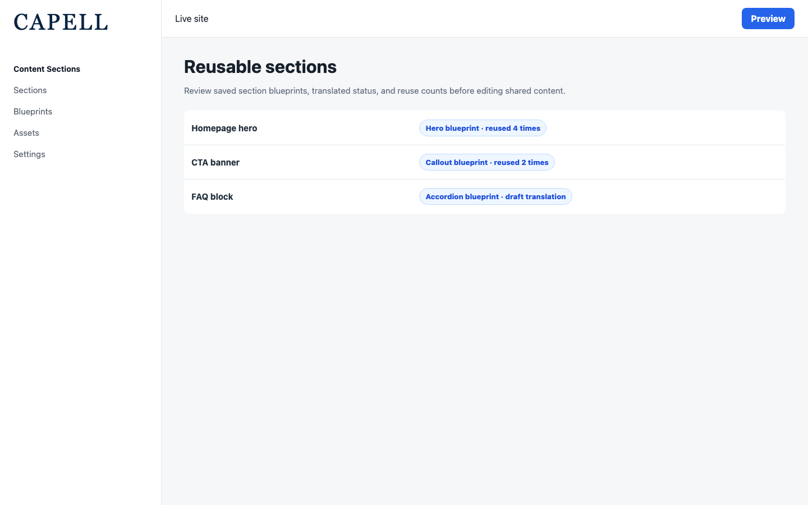
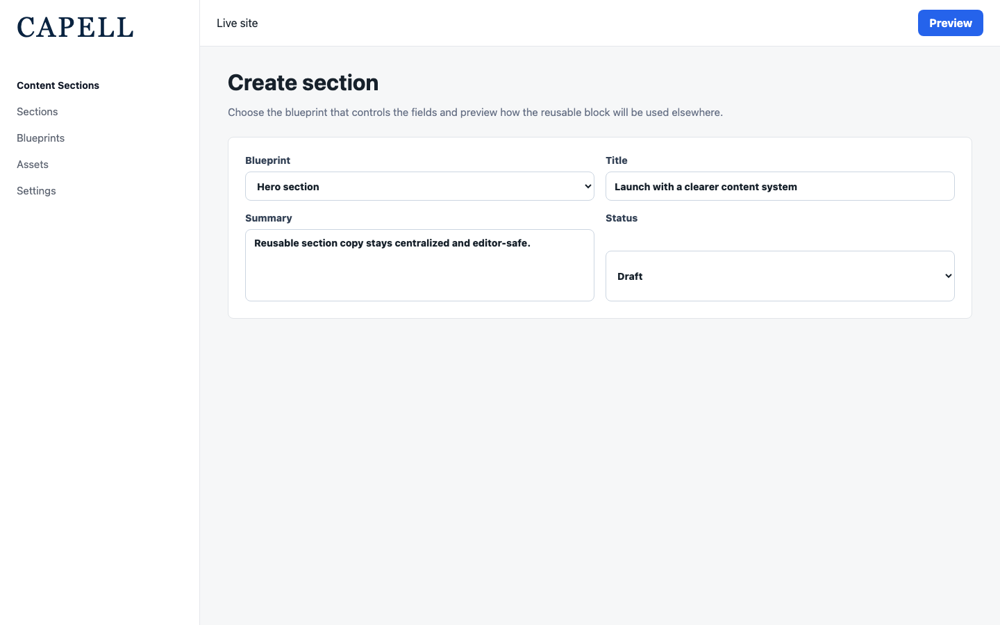

# Content Sections

<!-- prettier-ignore-start -->

## What This Plugin Adds

Content Sections is an **Available**, **Schema-owning** Capell package in the **Capell Foundation** product group. It ships as `capell-app/content-sections` and extends these surfaces: admin, frontend.

Content Sections adds reusable, publishable section records backed by registered blueprints and package-owned rendering components.

Editors create and publish shared sections in the admin and select them from other content surfaces; public pages receive the rendered section without admin metadata.

Evidence: [`capell.json`](capell.json), [`src/Models/Section.php`](src/Models/Section.php), [`src/Actions/RegisterDefaultSectionsAction.php`](src/Actions/RegisterDefaultSectionsAction.php), [`src/Providers/ContentSectionsServiceProvider.php`](src/Providers/ContentSectionsServiceProvider.php), [`docs/overview.admin.md`](docs/overview.admin.md), [`docs/screenshots.json`](docs/screenshots.json), [`tests/Feature/Filament/Resources/Section/SectionResourceTest.php`](tests/Feature/Filament/Resources/Section/SectionResourceTest.php), [`tests/Feature/SectionPublicOutputSanitisationTest.php`](tests/Feature/SectionPublicOutputSanitisationTest.php).

Status details:

- Status: Available
- Tier: free
- Bundle: foundation
- Composer package: `capell-app/content-sections`
- Namespace: `Capell\ContentSections`
- Theme key: not applicable

## Why It Matters

**For developers:** Section definitions are registered through a provider contract and resolved by Actions, so new section types can be added without placing queries or presentation logic in public views.

**For teams:** Teams can maintain repeated content in one section and reuse it across pages while preserving a controlled publishing workflow.

Evidence: [`src/Contracts/SectionDefinitionProvider.php`](src/Contracts/SectionDefinitionProvider.php), [`src/Support/SectionRegistry.php`](src/Support/SectionRegistry.php), [`src/Actions/ResolveSectionComponentAction.php`](src/Actions/ResolveSectionComponentAction.php), [`tests/Feature/SectionRenderingTest.php`](tests/Feature/SectionRenderingTest.php), [`docs/admin-guide.md`](docs/admin-guide.md), [`src/Actions/FinalizeSectionPublishAction.php`](src/Actions/FinalizeSectionPublishAction.php), [`tests/Feature/Publishing/SectionWorkspacePublishTest.php`](tests/Feature/Publishing/SectionWorkspacePublishTest.php).

## Screens And Workflow

Screenshot contract: `docs/screenshots.json`.

- Reusable sections index (admin, required evidence).
- Create reusable section form (admin, required evidence).
- Edit reusable section with assets (admin, required evidence).
- Section selector modal (frontend, required evidence).
- Frontend section widget gallery (frontend, required evidence).

## Technical Shape

- Service providers: `Capell\ContentSections\Providers\ContentSectionsServiceProvider`.
- Config files: `packages/content-sections/config/capell-content-sections.php`.
- Migrations: `packages/content-sections/database/migrations/2026_05_10_190844_01_create_sections_table.php`.
- Models: `ComposhipsJsonRelationshipsTrait`, `Section`.
- Filament classes: `CreateContentAction`, `ActionsRepeater`, `AssetsRepeater`, `BlueprintSelect`, `DetailsSchema`, `RelatedRepeater`, `SettingsSchema`, `TranslationsRepeater`, `ContentSelect`, `CustomColorInput`, `ContentNameColumn`, `HasAssetsRelationManager`, `and 28 more`.
- Livewire components: `AbstractAssets`, `SectionAssets`, `ModalTableSelect`.
- Route files: `packages/content-sections/routes/web.php`.
- Policies: `SectionPolicy`.
- Extension contracts: `SectionDefinitionProvider`.
- Actions: `BuildSectionAssetRenderDataAction`, `BuildSectionCreateFormDataAction`, `BuildSectionDemoDataAction`, `CancelScheduledSectionUnpublishAction`, `CloneSectionIntoWorkspaceAction`, `CreateHeroContentBlueprintAction`, `CreateSectionContentAction`, `EnsureSectionBlueprintForKeyAction`, `FinalizeSectionPublishAction`, `GetDefaultLanguageIdAction`, `ModifyContentSelectCreateAction`, `NormalizeSectionIconAction`, `and 7 more`.
- Data objects: `SectionAssetRenderData`, `SectionDefinitionData`, `SectionPublicRenderData`, `SectionVisibilityActionResultData`.
- Manifest contributions: `admin-resource: Capell\ContentSections\Manifest\ContentSectionsPackageContribution`, `asset: Capell\ContentSections\Manifest\ContentSectionsPackageContribution`, `configurator: Capell\ContentSections\Manifest\ContentSectionsPackageContribution`, `frontend-component: Capell\ContentSections\Manifest\ContentSectionsPackageContribution`, `model: Capell\ContentSections\Manifest\ContentSectionsPackageContribution`, `page-type: Capell\ContentSections\Manifest\ContentSectionsPackageContribution`, `route: Capell\ContentSections\Manifest\ContentSectionsRoutesContribution`, `schema-extender: Capell\ContentSections\Manifest\ContentSectionsSchemaExtendersContribution`.
- Health checks: `Capell\ContentSections\Health\ContentSectionsHealthCheck`.
- Blade views: `packages/content-sections/resources/views/components/section/asset.blade.php`, `packages/content-sections/resources/views/components/section/team-member.blade.php`, `packages/content-sections/resources/views/components/section/widget.blade.php`, `packages/content-sections/resources/views/livewire/filament/widgets-table-select.blade.php`, `packages/content-sections/resources/views/screenshots/section-selector-modal.blade.php`, `packages/content-sections/resources/views/screenshots/section-widget-gallery.blade.php`, `packages/content-sections/resources/views/section/demo.blade.php`.
- Cache tags: `content-sections`.

## Data Model

- Required tables: `sections`.
- Models: `ComposhipsJsonRelationshipsTrait`, `Section`.
- Core record references in migrations: `sites via site_id`.
- Migration files: `2026_05_10_190844_01_create_sections_table.php`.
- Migration impact: run host migrations through the package install flow before opening package surfaces.
- Deletion/retention behaviour: migrations declare cascade-on-delete relationships; no timed pruning or retention schedule is declared in `capell.json`.

## Install Impact

- Required packages: `capell-app/admin`, `capell-app/block-library`, `capell-app/core`, `capell-app/frontend`, `capell-app/layout-builder`.
- Admin navigation: declares `admin-resource: ContentSectionsPackageContribution`; each Filament page or resource controls its own navigation visibility.
- Admin/editor extensions: `configurator: ContentSectionsPackageContribution`, `schema-extender: ContentSectionsSchemaExtendersContribution`.
- Permissions: `ViewAny:Section`, `View:Section`, `Create:Section`, `Update:Section`, `Delete:Section`, `DeleteAny:Section`, `Restore:Section`, `RestoreAny:Section`, `ForceDelete:Section`, `ForceDeleteAny:Section`, `Replicate:Section`, `Reorder:Section`.
- Public routes: loads `routes/web.php`; registers `ContentSectionsRoutesContribution`.
- Database changes: package migrations are declared.
- Config: `config/capell-content-sections.php`.
- Settings: no package settings declared.
- Queues or schedules: none declared.
- Cache tags: `content-sections`.
- Commands: none declared.

## Common Pitfalls

- Keep required Capell packages on compatible v4 releases: `capell-app/admin`, `capell-app/block-library`, `capell-app/core`, `capell-app/frontend`, `capell-app/layout-builder`.
- Run migrations before opening package resources or public routes.
- Review package configuration before production-like verification: `config/capell-content-sections.php`.
- Review middleware, throttling, signatures, and public-output safety in `routes/web.php` before exposing routes.
- Keep public Blade and cached HTML free of authoring markers, model IDs, permissions, signed editor URLs, and lazy database queries.
- Custom write integrations must preserve invalidation for `content-sections` cache tags.

## Troubleshooting

| Symptom | Likely cause | Check | Fix |
| --- | --- | --- | --- |
| Package surface is missing after install | Provider or manifest is not loaded | Confirm `capell.json`, package `composer.json`, and provider registration | Reinstall the package, refresh Composer autoload, and clear host caches |
| Admin screen or command fails on missing table | Package migrations have not run | Check the tables listed in `Data Model` | Run host migrations and rerun the focused package test |
| Route returns unexpected output | Route cache, middleware, or signed URL setup does not match the package route file | Check the route files listed in `Technical Shape` | Clear route cache and verify middleware before exposing public routes |
| Public output leaks unexpected state | Render data, cache variation, or authoring boundary has regressed | Check public Blade, cache tags, and public-output safety tests | Move data loading out of Blade and rerun the package public-output tests |

## Quick Start

1. Install the package: `composer require capell-app/content-sections`.
2. Run the required setup: `php artisan migrate`.
3. Open the package admin surface at `/screenshot-fixtures/content-sections/sections-index` and confirm Content Sections is available.

## Next Steps

- [Package docs](docs/README.md)
- [Overview](docs/overview.md)
- [Admin guide](docs/admin-guide.md)
- Configuration files: [`config/capell-content-sections.php`](config/capell-content-sections.php).
- [Troubleshooting](#troubleshooting)
- [Screenshot contract](docs/screenshots.json)
- [Marketplace assets](docs/assets/marketplace/)
- [Capell content language plan](../../docs/CONTENT_LANGUAGE_PLAN.md)
- [Capell documentation design system](../../docs/DESIGN_SYSTEM.md)
- [Capell and package ERD notes](../../docs/erd/capell-and-package-erds.md)
- Related packages: [Block Library](../block-library/README.md), [Layout Builder](../layout-builder/README.md), [Publishing Studio](../publishing-studio/README.md), [Public Actions](../public-actions/README.md).
- Focused tests: `vendor/bin/pest packages/content-sections/tests --configuration=phpunit.xml`.

<!-- prettier-ignore-end -->
