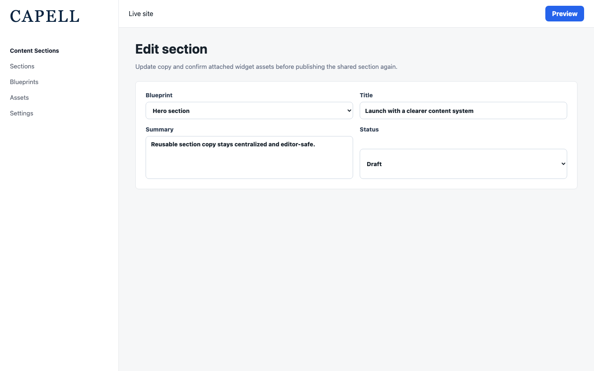

# Using Content Sections

This guide is for editors who build reusable sections and owners deciding when to use sections instead of one-off blocks. Every step uses the labels you see on screen.

## Using Content Sections (editor how-to)

### How to build a reusable section

1. Go to **Content > Sections**.
2. Click to create a new section and give it a clear name (for example "Newsletter call to action").
3. Choose the section blueprint that controls the available fields.
4. Add your blocks, text, and images.
5. Set its site and visibility dates as needed, then save. A section is available to other content surfaces, while its public output follows its publishing and visibility state.

### How to insert a section into a page

1. Open the page you want to edit.
2. Add a section from the **Section library**.
3. Pick the section by its name.
4. Save the page.

### How to edit once and update everywhere

1. Go to **Content > Sections** and open the section.
2. Make your change, confirm its visibility dates still allow it to be published, and save.
3. Public pages that resolve the section use the current published section content. You do not edit each use separately.

## Rolling out Content Sections (for owners)

### Turn on first

- **A few high-value reusable sections.** Start with content that genuinely repeats, like a call to action or a contact block, so editors see the benefit of editing once.

### Add when needed

| Need                           | Enable                                |
| ------------------------------ | ------------------------------------- |
| The same content on many pages | A reusable section                    |
| Content that only appears once | A one-off widget on that page instead |

### Don't enable yet

- Don't turn every block into a section. Sections are for content that repeats. One-off content is better as a plain widget.

### Who does what

| Role       | First useful screen                                       |
| ---------- | --------------------------------------------------------- |
| Editor     | **Content > Sections**: build and edit reusable sections            |
| Site owner | The **Content > Sections** list: see what is shared across the site |

## Troubleshooting for editors

| What you see                                          | What it means                                              | What to do                                                                                    |
| ----------------------------------------------------- | ---------------------------------------------------------- | --------------------------------------------------------------------------------------------- |
| I changed a section and it changed on other pages too | That is by design for pages that resolve the published section | Check where a section appears before editing, or make a separate section for the one-off case |
| I can't find the section to insert                    | It was not saved, is outside the current site scope, or its name is unclear | Open **Content > Sections** to confirm it exists and is available in the right site scope |
| The section looks empty on a page                     | It has no configured content, is outside its visibility window, or the page cache is stale | Add content, check visibility dates, save, and clear the page cache if needed |
